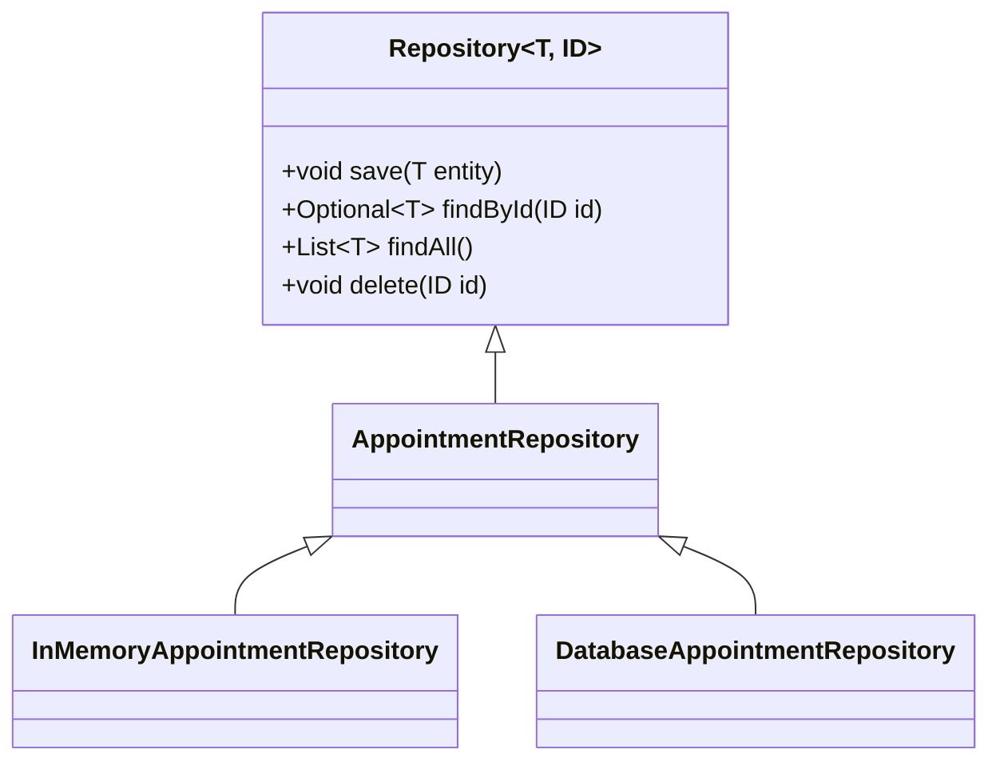

# Class Diagram (Repository Layer)

```mermaid
classDiagram
    class Repository~T, ID~ {
        +void save(T entity)
        +Optional~T~ findById(ID id)
        +List~T~ findAll()
        +void delete(ID id)
    }

    class AppointmentRepository {
    }

    class InMemoryAppointmentRepository {
    }

    class DatabaseAppointmentRepository {
    }

    Repository <|-- AppointmentRepository
    AppointmentRepository <|-- InMemoryAppointmentRepository
    AppointmentRepository <|-- DatabaseAppointmentRepository
```
