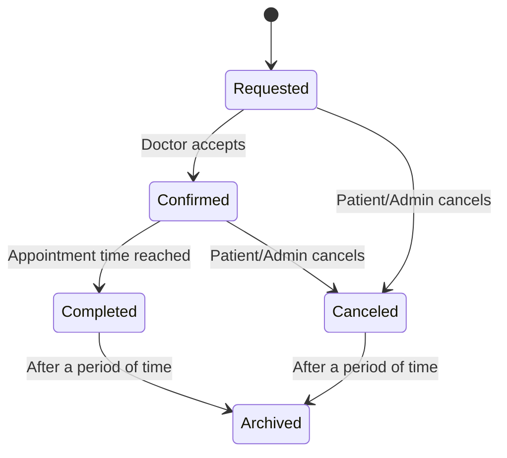
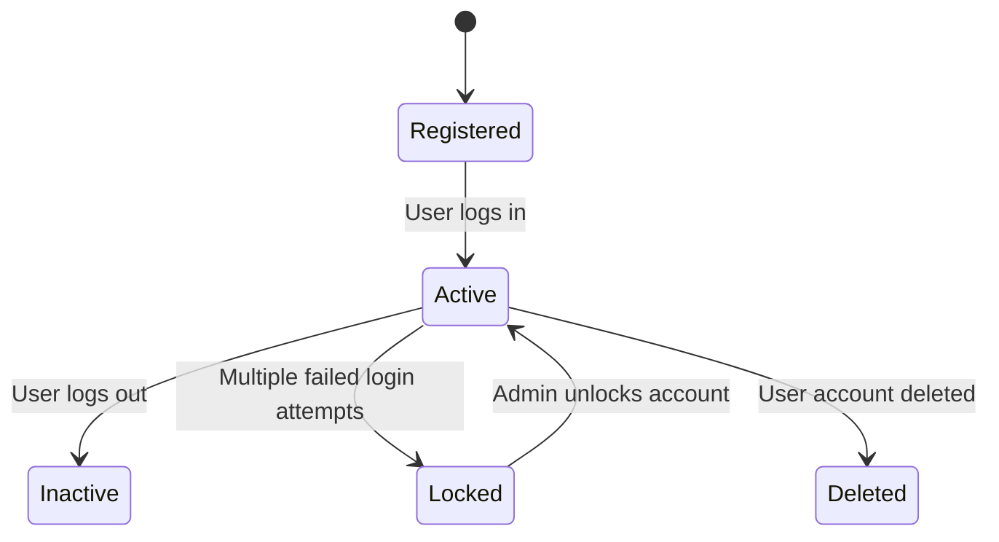
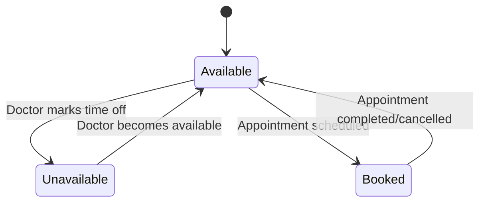
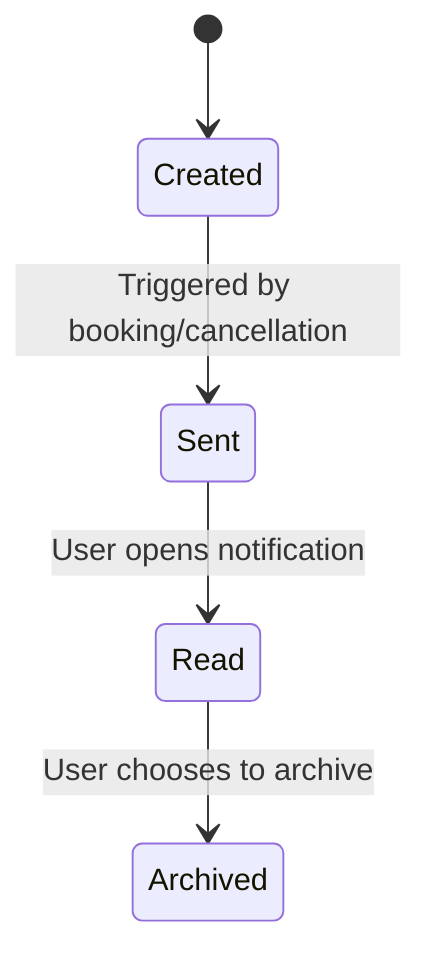
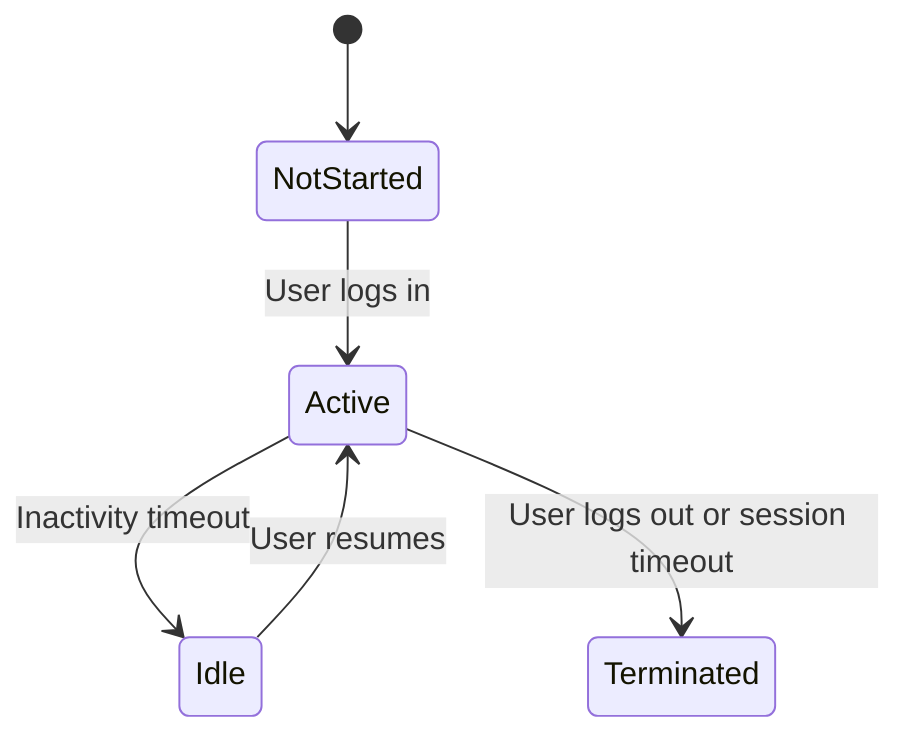
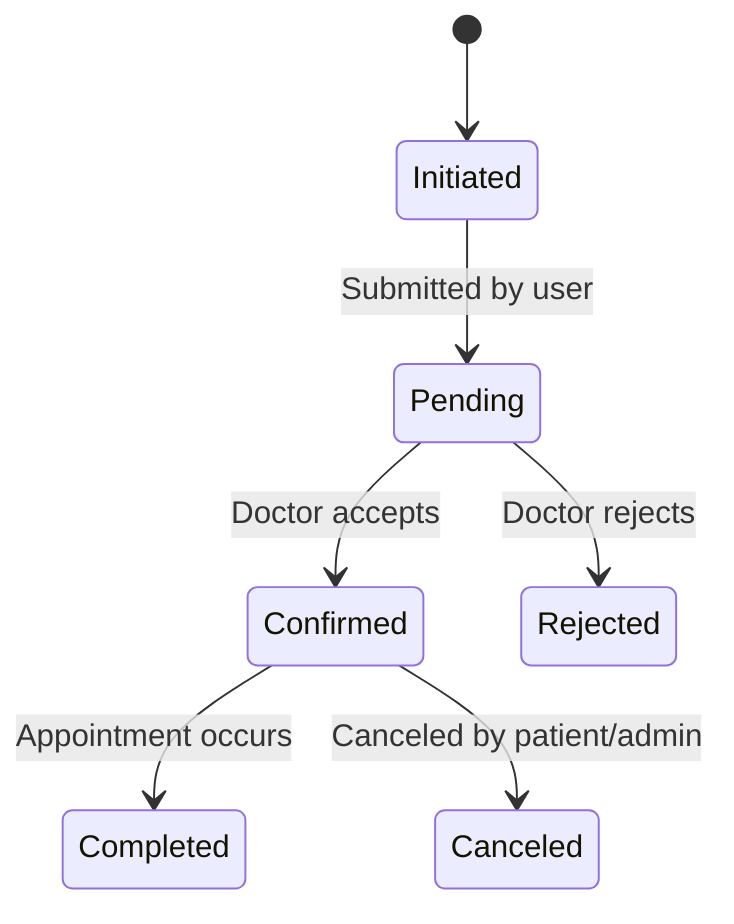
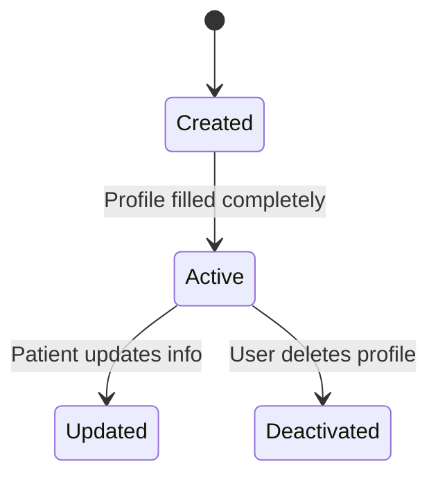
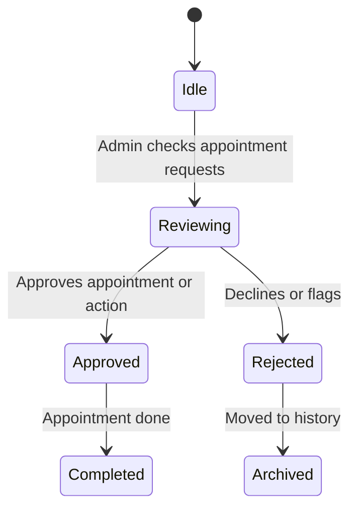

# 8 Critical Objects
### Critical Objects:
1. Appointment  
2. User Account  
3. Doctor Availability  
4. Notification  
5. System Session  
6. Booking Request  
7. Patient Profile  
8. Admin Action  

---
##  State Transition Diagram
### 1. **Appointment**  

### Explanation:
- **Key States:**
  - `Requested`: Patient books an appointment.
  - `Confirmed`: Doctor confirms the appointment.
  - `Completed`: The appointment has taken place.
  - `Canceled`: Appointment is canceled before it happens.
  - `Archived`: Moved to history for recordkeeping.
- **Transitions:**
  - Booking request → Requested.
  - Doctor accepts → Confirmed.
  - Time passes or user cancels → Completed or Canceled.
  - Both completed and canceled appointments move to `Archived`.
- **Functional Requirement Mapping:**
  - “The ‘Canceled’ state addresses FR-003: Allow users to cancel their own appointments.”
  - “The ‘Completed’ state supports appointment tracking and fulfillment (FR-002 & FR-005).”

---

Great! Let's create state transition diagrams and explanations in Mermaid for the following system objects:

---

### 2. **User Account**

**Explanation:**

- **Key States:** Registered, Active, Inactive, Locked, Deleted.
- **Transitions:**
  - `Registered → Active` when user logs in successfully.
  - `Active → Locked` if too many failed login attempts.
  - `Locked → Active` when an admin unlocks it.
  - `Active → Deleted` when the account is deleted.
- **Functional Mapping:** Supports **FR-001 (User Authentication)** and **FR-008 (Role-Based Access Control)**.

---

### 3. **Doctor Availability**

**Explanation:**

- **Key States:** Available, Booked, Unavailable.
- **Transitions:**
  - `Available → Booked` triggered by a confirmed appointment.
  - `Booked → Available` after the appointment is done or canceled.
- **Functional Mapping:** Supports **FR-005 (Doctor Availability Check)**.

---

### 4. **Notification**

**Explanation:**

- **Key States:** Created, Sent, Read, Archived.
- **Transitions:**
  - `Created → Sent` when the event triggers notification.
  - `Sent → Read` when user views it.
- **Functional Mapping:** Aligns with **FR-006 (Notifications & Reminders)**.

---

### 5. **System Session**

**Explanation:**

- **Key States:** NotStarted, Active, Idle, Terminated.
- **Transitions:**
  - `Active → Idle` due to inactivity.
  - `Idle → Active` if the user returns.
- **Functional Mapping:** Relates to **FR-009 (Exit & Auto-Save)** and **FR-001 (Authentication)**.

---

### 6. **Booking Request**

**Explanation:**

- **Key States:** Initiated, Pending, Confirmed, Rejected, Canceled, Completed.
- **Transitions:** 
  - Reflect real-world appointment flows.
- **Functional Mapping:** Covers **FR-002 (Booking)**, **FR-003 (Cancellation)**, **FR-004 (Search)**.

---

### 7. **Patient Profile**

**Explanation:**

- **Key States:** Created, Active, Updated, Deactivated.
- **Transitions:**
  - Allow patients to manage their own info.
- **Functional Mapping:** Supports user-centric access and data control.

---

### 8. **Admin Action**

**Explanation:**

- **Key States:** Idle, Reviewing, Approved, Rejected, Completed, Archived.
- **Transitions:**
  - Admin control and review flow.
- **Functional Mapping:** Tied to **FR-003 (Cancellation)** and **FR-008 (Role-Based Access)**.

---
