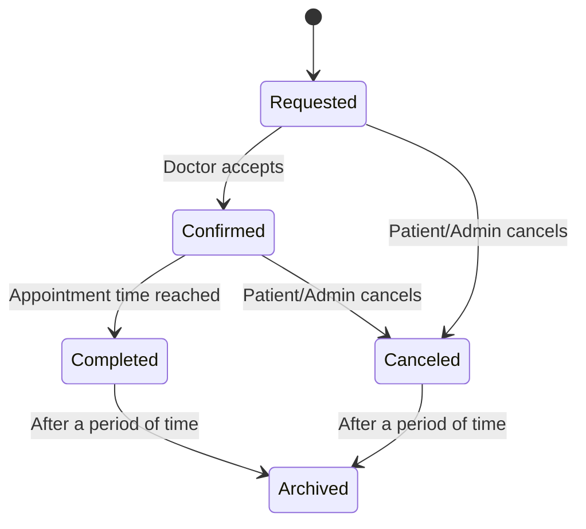

# 8 Critical Objects
### Critical Objects:
1. Appointment  
2. User Account  
3. Doctor Availability  
4. Notification  
5. System Session  
6. Booking Request  
7. Patient Profile  
8. Admin Action  

---
##  State Transition Diagram
### 1. **Appointment**  

### Explanation:
- **Key States:**
  - `Requested`: Patient books an appointment.
  - `Confirmed`: Doctor confirms the appointment.
  - `Completed`: The appointment has taken place.
  - `Canceled`: Appointment is canceled before it happens.
  - `Archived`: Moved to history for recordkeeping.
- **Transitions:**
  - Booking request → Requested.
  - Doctor accepts → Confirmed.
  - Time passes or user cancels → Completed or Canceled.
  - Both completed and canceled appointments move to `Archived`.
- **Functional Requirement Mapping:**
  - “The ‘Canceled’ state addresses FR-003: Allow users to cancel their own appointments.”
  - “The ‘Completed’ state supports appointment tracking and fulfillment (FR-002 & FR-005).”

---

